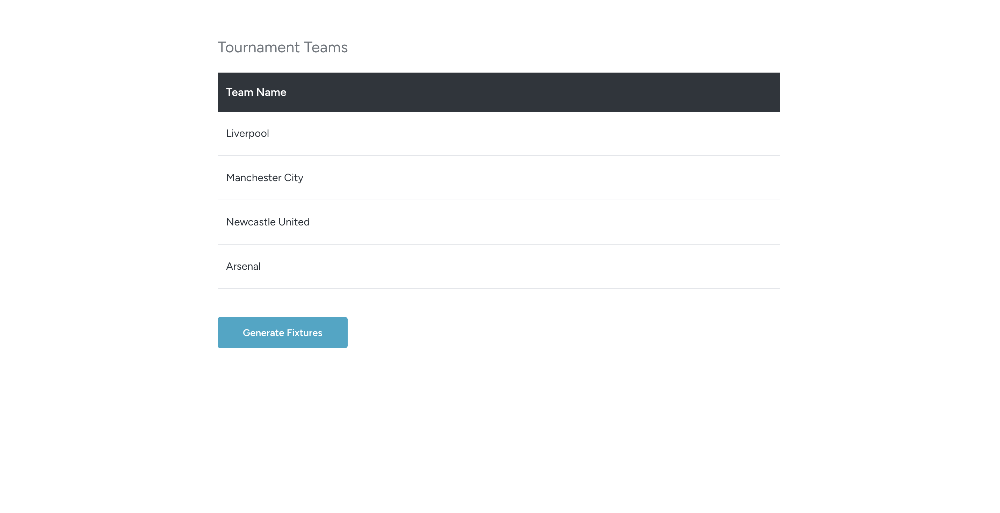
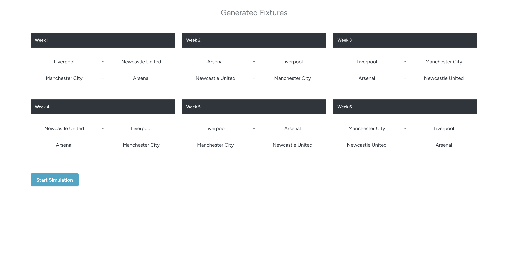
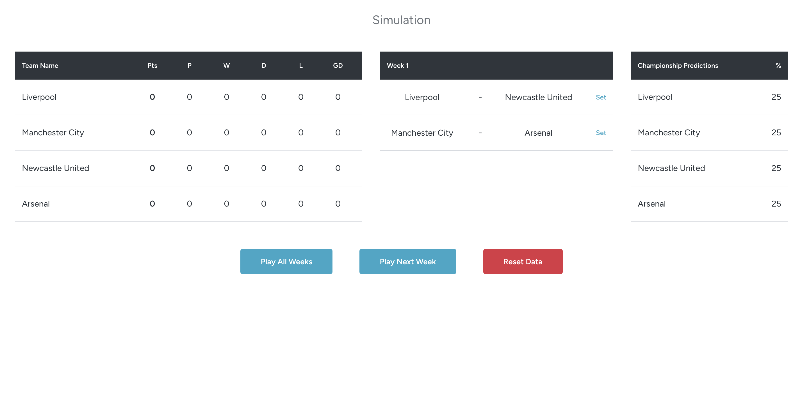
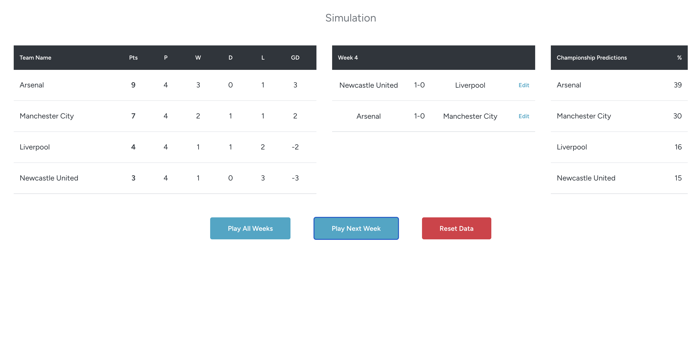

# Champions League Simulator

A 4-team league simulation project built with Laravel, Vue 3, and Inertia.js. The application generates fixtures dynamically, simulates matches based on team strength parameters, recalculates standings instantly, and allows manual editing of match results.

## Features

- 3-page flow: `Tournament Teams`, `Generated Fixtures`, and `Simulation`
- Dynamic fixture generation for a 4-team double round-robin league
- Week 1 and Week 2 home/away balancing rule
- Match simulation based on `attack`, `defense`, and `tactic` ratings
- Live standings table with points, wins, draws, losses, and goal difference
- Championship prediction calculation based on standings, goal difference, remaining points, and team strength
- `Play Next Week`, `Play All Weeks`, and `Reset Data` actions
- Manual match result editing with automatic standings and prediction recalculation
- Component-based Vue frontend structure
- Feature tests covering fixture generation, simulation flow, and championship prediction logic

## Tech Stack

- Backend: Laravel 13
- Frontend: Vue 3 + Inertia.js
- Styling: Tailwind CSS
- Database: SQLite/MySQL compatible through Laravel migrations
- Testing: PHPUnit / Laravel Feature Tests

## Screenshots

### Tournament Teams



### Generated Fixtures



### Simulation



### Simulation Progress



## How It Works

1. The first screen lists the tournament teams.
2. Clicking `Generate Fixtures` creates a dynamic 6-week schedule and routes the user to the fixture page.
3. The simulation screen lets the user:
   - play the next week,
   - play all remaining weeks,
   - reset match results without leaving the page,
   - edit played match scores manually.
4. Standings and championship predictions are recalculated after every simulation or manual score update.

## Project Structure

```text
app/
  Http/Controllers/     Request handling and page actions
  Models/               Eloquent models (Team, Fixture)
  Services/             Fixture generation, simulation, standings, predictions

database/
  migrations/           Database schema
  seeders/              Seed data for teams
  factories/            Test data factories

resources/
  js/Components/Simulator/   Reusable Vue components
  js/Pages/Simulator/        Page-level Vue components
  css/                       Global styles

routes/
  web.php               Application routes

tests/
  Feature/              Simulation, fixture, and prediction tests
```

## Team Strength Model

Each team has three ratings scored out of 100:

- `attack`
- `defense`
- `tactic`

The current seeded team profiles are tuned to reflect different football identities:

- `Manchester City`: highest tactical strength and the strongest overall title favorite
- `Arsenal`: strong defense and discipline-driven success
- `Liverpool`: balanced across all three metrics
- `Newcastle United`: average to below-average overall and less likely to win the league

## Running the Project

Install dependencies:

```bash
composer install
npm install
```

Prepare the environment:

```bash
cp .env.example .env
php artisan key:generate
php artisan migrate:fresh --seed
```

Start the development servers:

```bash
composer run dev
```

Alternative split-terminal setup:

```bash
php artisan serve
npm run dev
```

## Running Tests

```bash
php artisan test
```

## Notes

- Match fixtures are generated dynamically instead of using a fixed schedule.
- The second half of the season mirrors the first half with reversed home/away teams.
- Editing a match result updates both the standings table and championship predictions.

